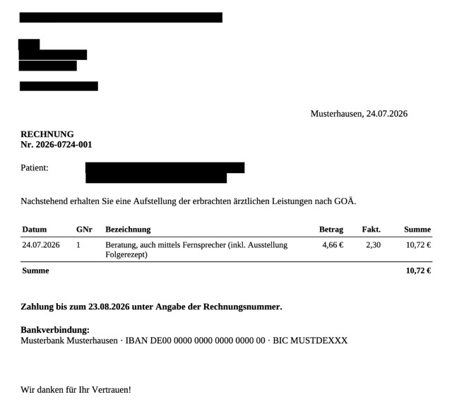

# PII redaction for German invoices

Blacks out personally identifiable information on scanned German invoices — names,
addresses, dates of birth, IBAN/BIC, e-mail, phone and account numbers — protecting
the people the invoice is *about* (the recipient, the patient), not the issuing
company's own details. **Everything runs locally on CPU; no page ever leaves the
machine.**


<table>
<tr>
<td width="50%">

<sub>The web UI: an uploaded German invoice with seven suggested redaction boxes highlighted over the sender line, the recipient address block, and the patient's name and date of birth, plus a toolbar to add, remove and download</sub>
</td>
<td width="50%">

<sub>Final result of the redaction</sub>
</td>
</tr>
</table>

Upload a scan, review what was found, fix the boxes by hand, download the redacted
file. The same pipeline is available as a batch **CLI** and a **REST API**.

- **Local and offline.** No cloud API, no telemetry. The Docker image bakes every
  model in and runs with `--network none`.
- **Human in the loop.** Detection proposes boxes; you correct them before the
  document is written. Assembly never re-runs the models, so what you saw is what
  gets filled.
- **German-specific.** Tuned for the layouts these invoices actually use — two-column
  dates of birth, `Anrede` lines, PLZ + city blocks, GOÄ fee tables.
- **Three engines**, one pipeline: swap the OCR backend or the classifier from config.

> [!WARNING]
> Automated detection is not a guarantee. Always review the result before sharing a
> redacted document — see [Limitations & safety](#limitations--safety).

## Contents

[Quick start](#quick-start) · [Running](#running) ([Web UI](#web-ui) · [CLI](#cli-batch) · [Docker](#docker)) ·
[REST API](#rest-api) · [Configuration](#configuration) · [How it works](#how-it-works) ·
[Performance](#performance) · [Project layout](#project-layout) ·
[Development](#development) · [Limitations & safety](#limitations--safety) · [License](#license)

## Quick start

Requires [uv](https://docs.astral.sh/uv/) and **Python 3.13** (PaddlePaddle has no
`cp314` wheels yet — pinned in `.python-version` / `pyproject.toml`).

```bash
# 1. Install dependencies
uv sync

# 2. Install the spaCy German model (needed by the Presidio classifier; not on PyPI)
uv run python -m spacy download de_core_news_lg

# 3. Redact the bundled example — writes example/GOÄ_Rechnung1_redacted.pdf
uv run pii-redact example/GOÄ_Rechnung1.pdf
```

The first run downloads ~180 MB of Paddle models into `.paddle_cache/` (see
[Where the models live](#where-the-models-live)). To get the browser app in the
screenshot instead, jump to [Web UI](#web-ui).

## Running

### Web UI

The Svelte SPA in [`frontend/`](frontend/) calls the REST API. Run it two ways.

> [!NOTE]
> The SPA picks the rasterization DPI (150/200/300) and unwarping in its own UI and
> sends both on every request, so `[redaction].pdf_dpi` / `[redaction].unwarp` (and
> `PII_UNWARP`) do **not** steer browser requests — they remain the defaults for the
> CLI and for API calls that omit the parameters. Changing either setting after a
> document is loaded re-runs detection, asking first if boxes were edited by hand.

> [!TIP]
> **Debug log.** The footer's *Debug log* button re-runs detection on the loaded
> document with [`debug=true`](#post-apiredact--find-the-pii-and-black-it-out) and
> shows the trace — why every box was suggested, and what was considered and
> dropped — with Copy and Download. It leaves the pages and your edited boxes
> untouched, so it costs one extra analysis and nothing else. This is what to
> attach to a bug report about a wrong box when the document itself cannot be
> shared.

**Development** (hot reload; two processes, two ports):

```bash
# Shell 1 — the API on :8000
uv run uvicorn backend.api:app --reload --port 8000

# Shell 2 — the Vite dev server on :5173
cd frontend && npm install && npm run dev
```

Open **http://localhost:5173**. Vite serves the SPA and proxies `/api` + `/health`
to the API on :8000 (configured in [`frontend/vite.config.ts`](frontend/vite.config.ts)),
so there is no CORS setup and no build step.

> [!NOTE]
> The proxy targets `127.0.0.1:8000`, not `localhost:8000`, on purpose: uvicorn binds
> IPv4 loopback while Node resolves `localhost` to IPv6 `::1` first on macOS — a
> `localhost` target would fail with `ECONNREFUSED`. If you bind the API elsewhere,
> update the proxy target to match.

**Production (single origin, no Docker).** The backend serves the *built* SPA itself,
so it is one process on one port. Build the static assets, then point the
`PII_STATIC_DIR` environment variable at the build output when starting the backend:

```bash
# 1. Build the SPA -> frontend/dist/
cd frontend && npm install && npm run build && cd ..

# 2. Start the backend with PII_STATIC_DIR pointing at the build output.
#    The path is resolved against the current directory — run this from the repo root.
PII_STATIC_DIR=frontend/dist \
  uv run gunicorn backend.api:app -k uvicorn.workers.UvicornWorker -w 2 -b 0.0.0.0:8000 --timeout 120
```

Open **http://localhost:8000** — the web UI *and* the API are served from the same
origin. (`uv run uvicorn backend.api:app --port 8000` works too for a single worker.)

> [!TIP]
> **If `/` returns 404**, `PII_STATIC_DIR` is unset or not pointing at a real
> directory: the API runs fine but no web UI is mounted. Make sure you ran
> `npm run build` (so `frontend/dist/` exists) and started the backend from the repo
> root with `PII_STATIC_DIR=frontend/dist`. This is exactly what the Docker image
> does — it bakes `dist/` in and sets `PII_STATIC_DIR` for you.

### CLI (batch)

```bash
# Redact files or directories in place (uses engine.name from config.toml)
uv run pii-redact example/GOÄ_Rechnung1.pdf
uv run pii-redact example/            # every jpg/jpeg/png/pdf in the folder

# Override the engine per run
PII_ENGINE=onnx uv run pii-redact example/
```

Output is written next to each input: a PDF comes back as `<name>_redacted.pdf`,
an image as `<name>_redacted.jpg` — images are always re-encoded as JPEG, exactly
as `POST /api/redact` returns them. Already-redacted files are skipped, and a file
that cannot be read (or that trips the page/pixel limits) is reported on stderr
without stopping the rest of the batch.

**The flags are the [`POST /api/redact`](#post-apiredact--find-the-pii-and-black-it-out)
query parameters**, same names, same defaults, same validation — so a run can be
translated into a request (and back) without a lookup table:

```bash
uv run pii-redact --no-unwarp --pdf-dpi 300 example/GOÄ_Rechnung1.pdf
uv run pii-redact --json-output example/   # -> <name>_redacted.json, the API's report
```

| flag | default | meaning |
|---|---|---|
| `--unwarp` / `--no-unwarp` | `redaction.unwarp` | flatten the photographed page before OCR |
| `--json-output` | off | write the JSON report to `<name>_redacted.json` *instead of* the document — the report embeds it as `redacted` |
| `--pdf-dpi N` | `redaction.pdf_dpi` | rasterization DPI for PDF input |
| `--jpeg-quality N` | `redaction.jpeg_quality` | quality of every JPEG produced |
| `--debug` | off | add the detection trace to the report as `debug` (needs `--json-output`) |

A flag you leave off is not sent, so its value comes from `config.toml` — the
single home of every default, for the CLI as for the service. Values are checked
by the same model the endpoint uses, so `--pdf-dpi 10` fails before any file is
touched, with the message the API would have returned as its `400` detail.

### Docker

One image serves both the redaction API and the web UI. `backend` serves the
built Svelte SPA as static files on the same origin, and **all model files are baked
in at build time**, so the container runs fully offline.

```bash
# Build for linux/amd64 (paddle has no linux-arm64 wheel; on Apple Silicon this
# runs under emulation).
docker build --platform linux/amd64 -t pii-redact .
docker run --rm -p 8000:8000 pii-redact
# open http://localhost:8000  (web UI)  ·  GET /health  ·  POST /api/...
```

- Multi-stage build: a Node stage builds the SPA; a `python:3.13-slim` stage runs
  the service. Only runtime deps are installed (`uv sync --no-default-groups` — no
  pytest, no notebook tooling).
- **Engines**: the image ships **native + onnx**. The `gliner` engine is an
  optional extra excluded from the image because it pulls `torch` + ~4.6 GB of CUDA
  libraries that CPU inference never uses. To include it, add `--extra gliner` to the
  two `uv sync` steps in the [Dockerfile](Dockerfile) (much larger image), or use it
  locally with `uv sync --extra gliner`.
- A build-time warmup ([docker/warmup.py](docker/warmup.py)) bakes the Paddle
  (native + ONNX) and UVDoc/doc-orientation models into the image (the spaCy model is
  a pip package). Runtime is offline — verify by running with **no network** and
  exec-ing a health check:
  ```bash
  docker run -d --name pii --network none pii-redact
  docker exec pii curl -fsS http://localhost:8000/health   # {"status":"ok",...}
  ```
- Tune workers with `-e WEB_CONCURRENCY=N` (default 1 — each worker loads the full
  model set into RAM; scale via container replicas, needs ~4 GB RAM each).
- Three config keys are overridable per container, without rebuilding or mounting a
  `config.toml`:
  ```bash
  docker run --rm -p 8000:8000 \
      -e PII_ENGINE=native -e PII_UNWARP=false -e PII_REDACT_REGIONS=false pii-redact
  ```
  The two booleans accept `true|false|1|0|yes|no|on|off`; anything else fails at
  startup rather than being silently ignored. For any other key, mount a file and
  point `PII_CONFIG` at it (`-v ./my.toml:/app/my.toml -e PII_CONFIG=/app/my.toml`).

### Server (API only)

```bash
# Dev (single worker, auto-reload off)
uv run uvicorn backend.api:app --host 0.0.0.0 --port 8000

# Production: N worker processes, each preloads the configured engine. This is
# how the service scales across the GIL — the heavy OCR/NER work runs in native
# code, and process-level workers give true parallelism (no external LB needed).
uv run gunicorn backend.api:app -k uvicorn.workers.UvicornWorker -w 2 -b 0.0.0.0:8000 --timeout 120
```

## REST API

Two endpoints, plus `GET /health` → `{"status":"ok","engine":{"name":"onnx",
"ocr":"onnxruntime","classifier":"presidio"}}`. The engine is fixed by `config.toml`
(or `PII_ENGINE`) and is **not** selectable per request. All options are query
parameters; an unknown one is a `400`, so a typo (`?unwrap=false`) cannot silently
do nothing.

### `POST /api/redact` — find the PII and black it out

Body: the **raw file** — PNG, JPEG or PDF bytes, not multipart.

| param | values | default | meaning |
|---|---|---|---|
| `unwarp` | `true` \| `false` | `redaction.unwarp` | flatten the photographed page before OCR |
| `json-output` | `true` \| `false` | `false` | return the JSON report, which embeds the file, instead of the bare file |
| `pdf-dpi` | integer | `redaction.pdf_dpi` | rasterization DPI for PDF input |
| `jpeg-quality` | 1–100 | `redaction.jpeg_quality` | quality of every JPEG produced |
| `debug` | `true` \| `false` | `false` | add the detection trace to the report; **requires `json-output=true`** |

**By default the file comes back, the same kind you sent:**

```bash
curl -X POST --data-binary @example/GOÄ_Rechnung1.pdf \
  -H "Content-Type: application/pdf" \
  http://localhost:8000/api/redact -o redacted.pdf
```

- PDF in → `application/pdf`, every page redacted, pages keeping their original
  physical size.
- PNG or JPEG in → `image/jpeg`, redacted. **Images always come back as JPEG.**

The file response carries no metadata: a document with nothing to redact and one
where detection failed both come back as a file. Use `json-output=true` when you
need to know *what* was found.

**`json-output=true` — the same work, reported instead of returned:**

```jsonc
{
  "unwarped": true,                          // whether dewarping actually ran
  "pages": [{
    "index": 0, "width": 1654, "height": 2339,
    "boxes": [[120, 88, 410, 118]],
    "image": { "content_type": "image/jpeg", "data": "<base64>" }
  }],
  "redacted": { "content_type": "application/pdf", "data": "<base64>" }  // image/jpeg for an image
}
```

- **`pages[].boxes` are always in the pixel space of `pages[].image`** — the image
  in the same entry, at its stated `width`/`height`. Never the uploaded file's
  coordinates: if `unwarp=true` the geometry changed, a PDF page was rasterized
  at `pdf-dpi`, and an uploaded image carrying an EXIF orientation tag was rotated
  upright on the way in. This is the one coordinate rule in the API.
- **`pages[].image` is NOT redacted.** It is the page the boxes describe, for review
  and editing — show it only to someone allowed to see the original.
- **`redacted` is the finished document**, always present: exactly the bytes the
  same request without `json-output` would have returned — `application/pdf` for a
  PDF, `image/jpeg` for an image. So one call gets you both the report *and* the
  result; you never re-run the models just to fetch the file.
- The report does not name the engine — it is fixed per process, so `GET /health`
  is where to read it.

**`debug=true` — why each box exists.** The report gains one more key, `debug`:
the detection trace as plain text, the same stream `PII_LOG_LEVEL=DEBUG` writes to
the log.

```
line @(244,889 525x47 conf=99.40): 'Musterstr. 13'
    match PERSON 0.85 'Musterstr. 13' [SpacyRecognizer]
    match DE_ADDRESS 0.70 'Musterstr. 13' [PatternRecognizer/de_street]
      Ignoring PERSON with only 1 name token(s)
    -> REDACT (static-rule)
```

Every OCR line with its pixel box, each classifier match under it, and the verdict
— which arm fired (`static-rule`, `labeled-value`, `name-memory`, `classifier`) or
why none did. It is how a wrong box is diagnosed without sending the document
anywhere; pages are marked off with `=== page N ===`. `debug=true` on its own is a
`400`: the file response carries no metadata, so there would be nowhere to put it.

### `POST /api/assemble` — turn (edited) boxes into a document

No models, no OCR, no unwarping: it fills rectangles and packages the result. Call
it once a human has reviewed what `/api/redact` reported.

```bash
curl -X POST -H "Content-Type: application/json" \
  -d '{"pages":[{"data":"<base64 jpeg>","boxes":[[10,5,30,25]]}]}' \
  "http://localhost:8000/api/assemble?format=pdf&dpi=200" -o redacted.pdf
```

```jsonc
{ "pages": [ { "content_type": "image/jpeg",   // optional, informational
               "data": "<base64 PNG or JPEG>",
               "boxes": [[10, 5, 30, 25]] } ] }
```

| param | values | default | meaning |
|---|---|---|---|
| `format` | `pdf` \| `jpeg` | `pdf` | `jpeg` requires exactly one page |
| `dpi` | integer | `redaction.pdf_dpi` | the resolution the images represent, so PDF pages get their true physical size |
| `jpeg-quality` | 1–100 | `redaction.jpeg_quality` | |

Boxes are in the pixel space of the image in the same entry. Returns
`application/pdf` or `image/jpeg`.

The two endpoints share only the box format: `/api/redact` reports what it found,
`/api/assemble` turns findings — reviewed, corrected, whatever — into a document.
Because assembly never runs the unwarper, the boxes cannot drift from the pixels;
the client fills the exact image it was given.

### Errors

Inputs are validated: unsupported media types are rejected (`415`), oversized bodies
by both the `Content-Length` header and a streaming cap (`413`, limit
`api.max_upload_bytes`), and images must decode within `api.max_image_pixels` (`400`,
decompression-bomb guard). Documents over `redaction.max_pages` are rejected (`400`),
as are malformed bodies and bad parameters. Errors are `{"detail": "…"}`.

## Configuration

All knobs live in [`config.toml`](config.toml) (engine, redaction fill/padding,
upload limits, worker count). Five environment variables override it, for
containers where editing the file is awkward:

| Variable | Overrides |
|---|---|
| `PII_CONFIG` | the path to the config file itself |
| `PII_ENGINE` | `[engine].name` |
| `PII_UNWARP` | `[redaction].unwarp` |
| `PII_REDACT_REGIONS` | `[redaction].redact_regions` |
| `PII_REDACT_CODES` | `[redaction].redact_codes` |

`PII_UNWARP` differs in reach from the other two, because `unwarp` also has a
wire name: `PII_UNWARP` sets the **default** for `?unwarp=` and `--unwarp`, so a
request that names the parameter still wins, while `redact_regions` and
`redact_codes` are neither query parameters nor flags and so those variables are
absolute. `PII_LOG_LEVEL=DEBUG`
(API and CLI) logs every OCR line with its box, plus each classifier match with its
score and the recognizer/context that produced it, followed by the redact verdict —
useful for seeing exactly why a line was or wasn't redacted.

Every key is optional — delete any of them and the default applies — but the file
is validated on load and a bad one **fails at startup rather than on the first
request**: an unknown key or section, a number out of range (`jpeg_quality = 500`),
or an engine that doesn't exist all raise immediately, naming the offender. A
mistyped key is a mistake, not a no-op.

### Region redaction

The sender of an invoice — the practice, the clearing house — identifies itself in
places no per-line detector can reach: a letterhead is usually a **logo**, and OCR
returns no line for a graphic. So `[redaction].redact_regions` (on by default)
adds boxes that are not tied to any single OCR line:

| Key (`[redaction.regions]`) | Default | Meaning |
|---|---|---|
| `header_frac` | `0.12` | how far down the page letterhead lines are looked for |
| `footer_frac` | `0.10` | how far up from the bottom imprint lines are looked for |
| `column_x_frac` | `0.50` | the sender column is looked for right of this |
| `column_y_frac` | `0.50` | …and its anchor must sit above this |
| `vgap_factor` | `0.5` | vertical gap, in line heights, that still counts as touching |
| `align_factor` | `0.4` | left-edge offset, in line heights, that still counts as aligned |
| `recipient_y_min_frac` | `0.05` | the recipient address block is seeded below this… |
| `recipient_y_max_frac` | `0.45` | …and above this, left of `column_x_frac` (`max <= min` disables) |

A band **spans the full page width** — that is what covers the logo, which sits
beside or above the text and which OCR never reports — but it is only as tall as the
text it found. The two fractions are a *search window*, not the band height:
widening one finds more letterhead, it does not blacken more paper. (A cap at 1.5×
the window bounds the height, since a single merged OCR box would otherwise set it.)

A band is drawn only when the text inside it **names a sender**: a company, a URL, a
titled name, an address. Text alone is not enough. On a continuation page the item
table can start at the very top of the sheet and the totals can sit in the bottom
tenth; there is no sender in either band, so no strip is drawn and nothing is
destroyed.

The **sender column** has no fixed extent, so it is not given one. Every line that
looks like a sender — company/legal form, URL, e-mail, phone, `Behandlung durch`, a
titled name, an address — seeds a block, which then absorbs any line adjoining one
already in it until nothing more does. Two lines adjoin when they are *both*
near-touching (`vgap_factor`) and share a left edge (`align_factor`). Recognition
and extent are separate: the anchor says *this is the sender*, the layout says
*this is how far it goes*.

Each block is a connected component, so it is the same set of lines whichever of
its members you start from. That matters more than it sounds: anything walking the
page in top-to-bottom order has to cope with the two columns of a letter
interleaving, where a recipient-address line sorting between two sender lines
splits the block and leaves a hole in the middle of it.

Both halves of the merge test are needed, and the thresholds are measured rather
than guessed. On one sample invoice the payment table *touches* the practice block
and only the misalignment cuts it; on another the table is *exactly* aligned and
only the gap does. Inside a real block the worst case measured is 0.41 and 0.14
against thresholds of 0.5 and 0.4.

The **recipient address block** is the same machinery pointed at the other window:
a street or ZIP+city line left of `column_x_frac`, inside the
`recipient_y_min_frac`–`recipient_y_max_frac` window, seeds a block that grows the
same way. The per-line rules already blacken the lines they recognize; this box
covers the lines *between* them — a c/o line, a company recipient, a name line OCR
garbled — which match nothing on their own. Only street and ZIP+city seed it (a
salutation also occurs over left-aligned body text, where growth would swallow the
paragraph); every deliverable address contains both, and the block reaches the
name and salutation lines above them.

Set a fraction to `0` to drop that one region; `redact_regions = false` (or
`PII_REDACT_REGIONS=false` in the environment) drops all of them. This is a
**config-only** setting — unlike `unwarp` it is not a query parameter and not a CLI
flag, so it is fixed per process like the engine. The boxes
it produces are ordinary boxes: they appear in the JSON report and are editable
(and deletable) in the web UI like any other.

### QR and DataMatrix redaction

A payment QR is the one piece of PII on an invoice that a reader does not have to
read. An **EPC QR / Girocode** encodes the IBAN, the BIC and the account holder's
*name*; a **Swiss QR-bill** adds the debtor's full address; a **DataMatrix** carries
an E-Rezept token or a securPharm pack identity. A page whose text is blacked out
but whose code still scans is not redacted — and no text rule can reach one, because
a code is a graphic and OCR returns no line for it.

So `[redaction].redact_codes` (on by default) detects QR, Micro QR and DataMatrix
symbols in the page image and blackens their bounding boxes. Detection is tuned for
**recall**: a symbol is covered once it is *located*, even when it does not decode.
That matters at the resolution real uploads have — the Girocode on one sample photo
is 60 px across and fails its checksum, which a decode-only reader would skip and
leave in the clear. Paying for the looser gate are two shape guards, since a symbol
that never decoded has nothing proving it real: a candidate is dropped if it is
under 12 px or more than 3:1 out of square. That is what rejects the run of item-table
rows one sample page reports as a 738×108 "DataMatrix". Across the sample corpus the
pass finds four real codes and nothing else.

| Key (`[redaction]`) | Default | Meaning |
|---|---|---|
| `redact_codes` | `true` | run the pass at all |
| `code_margin_frac` | `0.08` | grow each box by this fraction of its longer side |

The margin is headroom, not a correction: a *decoded* box already lands on the
symbol's edge to within about 1% of its width, even blurred or downscaled. It is
spent on the code's quiet zone, which the format requires to be blank paper.

**When a code is too coarse to decode**, though, what comes back is not one box per
symbol but one per *finder pattern* — a QR's three concentric corner squares each
read as a Micro QR. They do not touch each other, so taken at face value they leave
partial boxes pinned to the code's top-left corner with the rest of it showing. Three
things prevent that, in order: the page is re-read once at 2×, which is often enough
to turn the pieces back into a single exact read; failing that **OpenCV's QR
detector** is asked for the outline, which it derives from the finder patterns
without ever decoding; and only if that finds nothing are the pieces themselves
grouped and squared up, extending from their top-left anchor toward the symbol.

Note this is driven by how coarse the *code* is, not the page: a 15 mm Girocode is
only 118 px at the default 200 dpi and fragments on a full-resolution A4 scan. It is
also not a clean threshold — 12 mm decodes, 15 mm does not and 20 mm does again,
because it depends on how the module grid lands on the pixel grid. Coverage costs
little: the box comes out about 1.2× the symbol, which is roughly its quiet zone.

Like region redaction this is **config-only** — not a query parameter, not a CLI
flag — and its boxes are ordinary boxes in the report and the web UI. Turn it off
with `redact_codes = false` or `PII_REDACT_CODES=false`.

### Engine presets

A single pipeline (unwarp → OCR → per-line classify → draw a box) is configured
along two independent axes, selected by an **engine preset** in `config.toml`:

| Preset (`engine.name`) | OCR backend | PII classifier |
|---|---|---|
| `native` *(default)* | PaddleOCR (native) | Presidio (spaCy NER + custom regex recognizers) |
| `onnx` | PaddleOCR (ONNX Runtime, multi-core) | Presidio — *the same classifier as `native`* |
| `gliner` | PaddleOCR (native) | GLiNER (zero-shot NER) |

`native` and `onnx` differ **only** in the OCR inference backend: same detection
and recognition models, same Presidio classifier, same results. `native` is the
baseline; GLiNER is a close second; `onnx` is the fastest (~3.3× faster OCR at
identical accuracy).
Advanced users can override either axis (`engine.ocr_backend` / `engine.classifier`)
to unlock combinations the presets don't name.

**`engine.det_box_thresh`** (default `0.5`, below PaddleOCR's own `0.6`) is the
minimum detector score for a text box. It is a *mean* over the box, so a shape,
not faintness, is what pushes a line under it: one line of 6 pt type running the
full width of the page averages lower than the 11 pt table above it even where
its ink is just as dark. A photographed A4 invoice's imprint footer measured
0.5–0.6 and so was not detected **at all** — no box, no text, and hence no footer
band either, since the band needs a sender anchor to exist. Raise it if
background texture on a page is being read as text.

## How it works

Every engine runs the same pipeline per page ([`backend/pipeline.py`](backend/pipeline.py)),
built from three composable primitives — `unwarp()`, `compute_boxes()` (OCR +
classify), and `apply_boxes()` (fill):

1. **Unwarp** the page with UVDoc. Photographed paper curls at the edges, tilting the
   marginal lines so the detector misses them (e.g. the second bank line, the bottom
   managing-director line). Unwarping runs as an **explicit separate step**
   (`create_pipeline("doc_preprocessor")` with `use_doc_unwarping=True`) that returns the
   flattened image; PaddleOCR's own `use_doc_unwarping` is deliberately **disabled** —
   if OCR unwarped internally, the returned boxes would refer to an unwarped image we
   never get back, with no way to map them onto the curled original. By flattening
   first ourselves we hold that image, OCR + redact it, and the boxes align by
   construction.
2. **OCR per line.** PaddleOCR returns one box + text per line. Each line is classified
   **on its own**, never as one page-wide blob: PaddleOCR's reading order interleaves the
   two columns of these invoices, which pollutes the text around an entity and makes NER
   miss names it recognizes fine in isolation. Per-line text is
   coherent, so both NER and the regex/context rules work.
3. **Classify** the line (this is where the engines differ, see below). The
   shared deterministic rules — salutation, titled name (`Dr. Weber`), German
   street / PLZ+city, sender identity (legal form, URL/e-mail/phone, registry and
   banking identifiers), and the spatial date-of-birth matcher
   ([`backend/rules.py`](backend/rules.py)) — are applied uniformly first, then
   the model-based classifier.
4. **Draw** a filled black rectangle over the line's box (with a 2 px pad) if it is judged
   to contain PII.
5. **Add the region boxes** — header band, footer band, sender column
   ([`backend/regions.py`](backend/regions.py)) — not derived from an OCR line, and
   therefore able to cover a letterhead logo. See
   [Region redaction](#region-redaction).
6. **Add the matrix-code boxes** — QR, Micro QR, DataMatrix
   ([`backend/codes.py`](backend/codes.py)) — the only pass that reads the page
   *pixels* rather than the OCR lines, because a payment QR is machine-readable PII
   that no text rule can see. See
   [QR and DataMatrix redaction](#qr-and-datamatrix-redaction).

### `presidio` classifier

Redacts these entities: `PERSON`, `IBAN_CODE`, `BIC_CODE`, `DE_ADDRESS`, `EMAIL_ADDRESS`,
`KONTO`, `PHONE_NUMBER`, `CREDIT_CARD`.
`LOCATION` is deliberately excluded — the NLP model fires it on the letterhead, and the
recipient's street/city is already covered precisely by `DE_ADDRESS`. Custom recognizers
on top of the built-in IBAN/e-mail/credit-card ones:
- **BIC/SWIFT** — `AAAABBCC[DDD]`, case-sensitive, low base score + `bic`/`swift` context
  so all-caps German words like `RECHNUNG` don't match.
- **PHONE_NUMBER** — `python-phonenumbers`, restricted to the `DE` region only; the
  default region list runs 8 regional matchers per line and lets foreign formats match
  random digit columns. Two shapes are dropped: a dotted date (`09.07.2026`, optionally
  swallowed together with the code column beside it, `12.12.15 51-61`) — dates aren't PII
  except the birthdate, which is handled spatially (see below) — and an **undelimited
  digit run** (`2106315267`), which is a lab or order number; a real number here is
  written with a separator (`0231 000000- 000`) or carries a `Tel`/`Fax` label, and a
  labeled one is already caught deterministically before the classifier runs.
- **KONTO** — a German account number or bank code *with its label* (`Kto.`, `Konto-Nr.`,
  `BLZ`, `Bankleitzahl` followed by digits), since lines are classified one at a time and
  the label is always on the same line as the number.
- **DE_ADDRESS** — a German street pattern (suffix attached, `Musterstrasse 23`, or its
  own capitalized word, `Muster Straße 23`) and a PLZ + city pattern. Both accept the
  all-caps form a letterhead prints. For the street, the *suffix* is case-insensitive and
  the name part may be all caps (`MUSTERSTR.23`, house number glued on), with the
  leading capital still required. A city is either capitalized (`Musterstadt`, `Ulm`) or
  **all caps with at least four letters** (`MUSTERSTADT`) — four is what separates a real
  city from the short all-caps noise a Leistungstext is full of (`15118 MID`), at the
  price of `ULM`/`HOF`/`AUE` written that way. The postcode must also **start a token**:
  a Heilmittel position number ends in five digits and is followed by its Leistungstext
  (`44/20101 Massage`, `49/21520 Naturmoor`), which is the ZIP+city shape exactly — down
  to `20101` being a real Hamburg postcode, so only the token boundary can tell them
  apart. A hyphen is still admitted after a letter (`D-12345 Musterhausen`) and refused
  after a digit (`44-20101`). The space between postcode and city is **optional** — a
  narrow address column prints them flush and OCR returns `12345Musterstadt` as one token.
  The city pattern is *imported* from `backend/rules.py` rather than restated, since the
  two are meant to agree.

### `gliner` classifier

Each line is passed to GLiNER against the PII label set; a match redacts it. `person`
must be multi-word (drops single-token noise). Because GLiNER's zero-shot `address` label
is unreliable on standalone lines, the shared deterministic street / PLZ+city regexes
(applied to every engine) close that gap (see special cases).

### Special cases handled

- **Name in the next column.** A patient block often prints `Patient:` (or `Versicherte`,
  `Name`, `Person`, `Mitglied`, …) alone in one cell with the name beside it — two
  separate OCR lines, so no same-line rule can pair them, and a bare `Wolf,Uwe` gives the
  NER model nothing to hold on to. The same spatial matcher used for birth dates carries
  a **name** row: a label standing alone in its cell makes a two-token name (`Max
  Mustermann`, `MUSTER, ANDREA`, `Wolf,Uwe`) on its row a value. The label must be the
  *whole* cell — an unanchored `Patient` would turn a Leistungstext sentence into a label
  and blacken whatever capitalized pair happened to share its row.
- **Date of birth (three layouts).** The label and the date are usually separate OCR
  lines, so a same-line rule can't see the label; birth dates are matched **spatially**
  instead, in whichever of three arrangements the document uses:
  1. *Beside* — the date's vertical center shares a row with a birth-label line
     (`Geburtstag`, `Geburtsdatum`, `geboren`, and the abbreviations `Geb.Dat.` /
     `Geb.-Dat.` / `GebDat`). The bare `geb.` is still **not** a label on its own: it also
     means *Gebühren* (the `Geb.Nr.` fee column) and would redact treatment dates.
     `Geb.Dat.` is safe because *Gebührendatum* is not a word on an invoice.
  2. *Below* — `Geburtsdatum` alone in a cell at the top of a column, the dates running
     down beneath it, so nothing shares a row with any of them. The header claims a line
     whose horizontal *center* falls in its own x-range (a header is wider than its
     dates, so overlap would reach into neighbouring columns), and the walk stops at the
     first non-date or a vertical gap over 3× the median line height — a header may never
     claim the rest of the page.
  3. *Merged* — label and date in one line, marked by the abbreviation (`geb. 30.09.1954`)
     or by the **`*` birth mark** (`*21.01.1975`, `* 21.01.1975`), which on German
     paperwork reads *geboren*. The date must follow the star directly, so a footnote
     marker introducing a sentence (`* Leistungen ab 01.01.2024`) doesn't match.

  Any of the three also makes the names on that line *name evidence*, since a name beside
  a birthdate is there because of it.
- **Salutation (Anrede).** Any line containing a salutation word (`Herr(n)`, `Frau`,
  `Familie`, …) is redacted — lone (the `Herrn` line above the address) or with a name
  (`Herr Muster`, where NER tags only the single surname token, which the multi-word guard
  drops). A lone salutation carries no information, so over-redacting it is harmless and
  keeps the rule to a single regex (`SALUT`).
- **Titled name.** An academic/medical title followed by a capitalized name
  (`Dr. Weber`, `Prof. Dr. med. Hans Müller`) is redacted by a deterministic rule —
  the NER model is unreliable around titles, missing the name after a doubled
  `Dr. Dr.` and tagging only the single token after `Dr. Weber`, which the PERSON
  multi-word guard then drops.
- **Surname, forename and birthdate on one unlabeled line.** `Muster,Andrea 05.03.11`
  — how a patient table row is written — is invisible to everything else: NER returns
  only the forename (the surname falls outside the `PERSON` span, leaving a single
  token the guard drops), and the date has no `geb.`/`Geburtsdatum` to pair with, so
  the spatial birthdate matcher can't reach it either. A deterministic rule matches the
  pair — `Surname,Forename` immediately followed by a date — which redacts the whole
  line, name and date together, and feeds the surname to the name memory. Both halves
  are required: a Leistungstext can hold two comma-joined capitalized nouns
  (`Mikroskopie,Kultur`), and a bare date in an item row is a treatment date.
- **Name memory across casings.** Surnames harvested from deterministic person evidence
  are redacted on bare recurrence elsewhere in the document. The match is whole-word
  (that, not letter case, is what keeps `Allgemeine` from matching a Dr. Allgemein) and
  **case-insensitive with one condition: the occurrence must start with a capital**. One
  document prints the same person as `Andrea Muster` in the address block and
  `MUSTER, ANDREA` in the patient row, so a memory holding a single casing would miss
  half of them — while a lowercase hit is the ordinary German word a surname collides
  with (`Klein` the person vs `klein gedruckt`), which is why this isn't a plain
  case-insensitive match.
- **Address block completeness (GLiNER).** GLiNER's `address` label dropped the standalone
  PLZ+city line in the recipient block, leaving it visible. The deterministic street /
  PLZ+city regexes (same as Presidio's) close that gap so the Adressfeld is fully covered.
- **The item table.** An invoice's body is a table of fee numbers, service texts and
  amounts; the PII sits *above* it (recipient, patient block) or *below* it (imprint,
  bank details). So the classifier — the one detector with no anchor of its own — does
  not run on table lines at all. The band is found geometrically: lines holding a German
  amount merge into rows, rows cluster by vertical gap, and a cluster of ≥2 rows spans
  the table (so a lone `Zahlbetrag` in a footer gates nothing, and a stray amount above
  the recipient block can't stretch the band over it). Every deterministic rule and the
  name memory keep working inside the table — only an *unlabeled, never-before-seen*
  name in an item row is given up.
- **PERSON false positives.** A `PERSON` needs **≥2 proper-noun tokens** ("First Last") to be
  redacted. Capitalization alone is not evidence in German — every noun is capitalized, so a
  two-word Leistungstext (`Orientierende Testuntersuchg.`) is shaped just like a name to the
  NER model, while spaCy's tagger calls `Orientierende` a NOUN. The coarse tag (`pos_`) is
  what's read, not the NER tag: `Cleed` (of the culture medium `Cleed Agar`) is `tag_=NE`
  but `pos_=ADV`. The rule also still drops single-token noise (`5.0016`).
  **Across a comma the bar is only capitalization**, because `Surname,Forename` is how a
  patient row is written and NER returns just one half of it — while the surnames it omits
  (`Bauer`, `Jäger`, `Wolf`) are ordinary German words the tagger calls nouns. That is safe
  because something on the line must still have been recognized as a `PERSON`, and the
  Leistungstexte this guard exists to reject (`Mikroskopie,Kultur`, `Summe,Betrag`,
  `Ferritin,CRP`) produce no `PERSON` entity at all — so there is no span to extend.
- **Service dates vs. birth dates.** Treatment/invoice dates (`18.02.2026`, `Rechnungsdatum
  09.07.2026`) are never in a birth-label row, so they stay visible — no over-redaction.

### Models & libraries

- **PaddleOCR 3.x** (`paddleocr`, `paddlepaddle`) — text detection + recognition,
  German model. Returns axis-aligned pixel boxes per text line (`rec_texts` / `rec_scores`
  / `rec_boxes`).
- **PaddleX `doc_preprocessor` (UVDoc)** — document unwarping, to flatten curled
  photos before OCR.
- **Presidio** (`presidio-analyzer`) — PII analysis, driven by
  a **spaCy `de_core_news_lg`** German NLP model plus custom recognizers.
- **GLiNER** (`gliner`, model `urchade/gliner_multi_pii-v1`) — zero-shot NER; each line is
  scored against a fixed label set (`person`, `address`, `email`, `iban`, `bic`).
- **PyMuPDF** (`pymupdf`) — renders PDF pages to images at 200 dpi.
- **Pillow** — draws the redaction rectangles.

### Where the models live

| Model | Stored in | Used by |
|---|---|---|
| PaddleOCR + UVDoc weights (see table below) | `.paddle_cache/official_models/` (project, git-ignored) | every engine |
| `de_core_news_lg` (spaCy German) | `.venv/lib/python3.13/site-packages/de_core_news_lg/` (a pip package, **not** a cache) | `native` / `onnx` engines |
| `urchade/gliner_multi_pii-v1` (GLiNER) | `.gliner_cache/` (project, git-ignored) | `gliner` engine only |

The Paddle weights (~180 MB) live in **`.paddle_cache/`**; the code sets
`PADDLE_PDX_CACHE_HOME` there automatically. On first run Paddle downloads them; if you
already have them under `~/.paddlex`, copy that folder to `.paddle_cache` to skip the
download.

### The four Paddle models

Every engine shares the same OCR + unwarp front end, so each run loads the **same
four** models:

| Model in `official_models/` | Role | Loaded by |
|---|---|---|
| `PP-OCRv6_medium_det` | Text **detection** (finds line boxes) | `PaddleOCR(...)` |
| `PP-OCRv6_medium_rec` | Text **recognition** (reads the German text) | `PaddleOCR(...)` |
| `UVDoc` | Document **unwarping** (flattens curled pages) | `create_pipeline("doc_preprocessor")` |
| `PP-LCNet_x1_0_doc_ori` | Page-orientation classifier — instantiated by the `doc_preprocessor` pipeline but **disabled at predict time** (`use_doc_orientation_classify=False`), so it is loaded but not applied | `create_pipeline("doc_preprocessor")` |

The code sets its offline / quiet environment automatically (`HF_HUB_OFFLINE`,
`TRANSFORMERS_OFFLINE`, `PADDLE_PDX_DISABLE_MODEL_SOURCE_CHECK`, and paddlex log level), so
no environment variables need to be passed on the command line.


## Project layout

```
backend/            the whole Python package — pipeline, CLI and REST service
  pipeline.py       the three primitives: unwarp / compute_boxes / apply_boxes
  service.py        framework-free core shared by the CLI and the API
  api.py            FastAPI app: request reading, response shaping, static SPA
  cli.py            batch CLI (flags mirror the /api/redact query parameters)
  options.py        pydantic validation for query options and the assemble body
  config.py         config.toml schema + engine preset resolution
  rules.py          deterministic German patterns (salutation, street, birthdate)
  regions.py        header/footer bands and the sender column (not line-derived)
  codes.py          QR / DataMatrix boxes — the only source that reads pixels
  ocr/ classifiers/ the two swappable axes behind an engine preset
frontend/           Svelte 5 + Vite SPA, calls the REST API directly
tests/              fast tests stub the models; `-m slow` runs the real ones
docker/warmup.py    bakes the models into the image at build time
example/            a sample invoice as PDF and PNG
```

## Development

```bash
uv sync --group dev           # + pytest, httpx

uv run pytest -m 'not slow'   # fast: no ML models load (validation, rules, composition)
uv run pytest -m slow         # end-to-end on example/GOÄ_Rechnung1.pdf (loads real models)
```

Adding or removing a dependency? Update [`LICENSE.md`](LICENSE.md) in the same
change — it is the third-party license inventory, and it determines the license of
the built image.

## Limitations & safety

- **Detection is best-effort.** It is statistical NER plus hand-written rules, not a
  guarantee. Missed PII is possible on layouts unlike the ones it was tuned for.
  **Review every document before releasing it.** The web UI exists for exactly this.
- **Region redaction is deliberately blind across the page width.** A band only
  fires when it holds sender text, but once it does it covers everything on those
  rows, logo and legitimate content alike (`Seite 1 von 2`, a page number sharing a
  row with a bank line). That is the price of covering a letterhead graphic, which
  no text-based rule can reach. Tune `[redaction.regions]` or set
  `redact_regions = false` (or `PII_REDACT_REGIONS=false`) if it costs you more
  than it buys.
- **Code detection is tuned for recall, so it can over-cover.** A candidate only has
  to be *located*, not decoded, which is what catches a Girocode too coarse to scan;
  the size and squareness guards are all that stand between that and a dense block of
  table rules. If a page loses a square graphic it should have kept, set
  `redact_codes = false` (or `PII_REDACT_CODES=false`). Note also that only QR, Micro
  QR and DataMatrix are covered — 1D barcodes and PDF417 are not.
- **Redaction is destructive drawing, not text removal**, which is what makes it safe:
  output pages are rasterized images with filled rectangles, so there is no selectable
  text layer left underneath to recover. The trade-off is that redacted PDFs are images
  and are no longer searchable.
- **The file response tells you nothing.** A clean document and a failed detection are
  indistinguishable — use `json-output=true` if you need to know what was found.
- **`pages[].image` in the JSON report is the *un*redacted page.** Treat that payload
  as sensitive as the original.
- **German invoices only.** The rules encode German salutations, street forms and
  PLZ patterns; other languages and layouts are out of scope.

## License

This project's own source code is **MIT** — see [`LICENSE`](LICENSE).

Third-party packages and pretrained models carry their own licenses, inventoried in
[`LICENSE.md`](LICENSE.md). Note one consequence there: **the built Docker image is
AGPL-3.0**, because it bundles PyMuPDF (AGPL-3.0, dual-licensed with a paid Artifex
commercial alternative). That does not relicense this repository's code; it means
anyone served by a deployment of the image can request the complete source of the
combined work.
