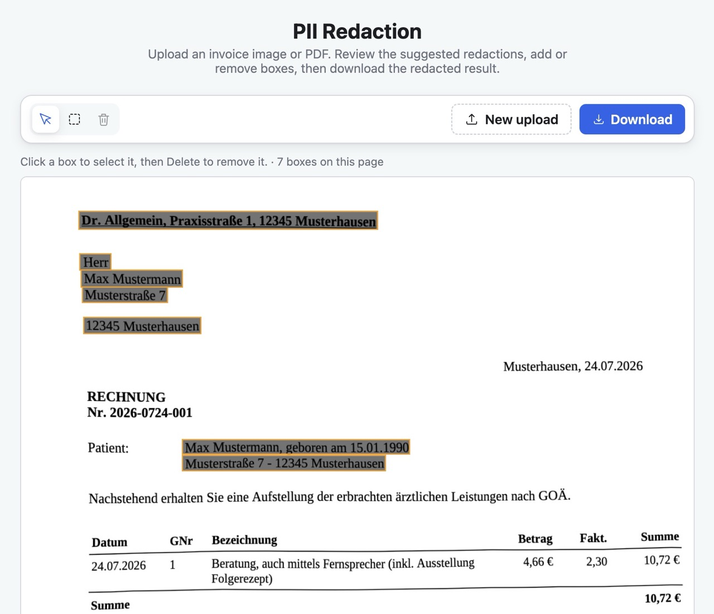

# PII redaction for German invoices

Blacks out personally identifiable information on scanned German invoices — names,
addresses, dates of birth, IBAN/BIC, e-mail, phone and account numbers — protecting
the people the invoice is *about* (the recipient, the patient), not the issuing
company's own details. **Everything runs locally on CPU; no page ever leaves the
machine.**




Upload a scan, review what was found, fix the boxes by hand, download the redacted
file. The same pipeline is available as a batch **CLI** and a **REST API**.

- **Local and offline.** No cloud API, no telemetry. The Docker image bakes every
  model in and runs with `--network none`.
- **Human in the loop.** Detection proposes boxes; you correct them before the
  document is written. Assembly never re-runs the models, so what you saw is what
  gets filled.
- **German-specific.** Tuned for the layouts these invoices actually use — two-column
  dates of birth, `Anrede` lines, PLZ + city blocks, GOÄ fee tables.
- **Three engines**, one pipeline: swap the OCR backend or the classifier from config.

> [!WARNING]
> Automated detection is not a guarantee. Always review the result before sharing a
> redacted document — see [Limitations & safety](#limitations--safety).

## Contents

[Quick start](#quick-start) · [Running](#running) ([Web UI](#web-ui) · [CLI](#cli-batch) · [Docker](#docker)) ·
[REST API](#rest-api) · [Configuration](#configuration) · [How it works](#how-it-works) ·
[Performance](#performance) · [Project layout](#project-layout) ·
[Development](#development) · [Limitations & safety](#limitations--safety) · [License](#license)

## Quick start

Requires [uv](https://docs.astral.sh/uv/) and **Python 3.13** (PaddlePaddle has no
`cp314` wheels yet — pinned in `.python-version` / `pyproject.toml`).

```bash
# 1. Install dependencies
uv sync

# 2. Install the spaCy German model (needed by the Presidio classifier; not on PyPI)
uv run python -m spacy download de_core_news_lg

# 3. Redact the bundled example — writes example/GOÄ_Rechnung1_redacted.pdf
uv run pii-redact example/GOÄ_Rechnung1.pdf
```

The first run downloads ~180 MB of Paddle models into `.paddle_cache/` (see
[Where the models live](#where-the-models-live)). To get the browser app in the
screenshot instead, jump to [Web UI](#web-ui).

## Running

### Web UI

The Svelte SPA in [`frontend/`](frontend/) calls the REST API. Run it two ways.

**Development** (hot reload; two processes, two ports):

```bash
# Shell 1 — the API on :8000
uv run uvicorn backend.api:app --reload --port 8000

# Shell 2 — the Vite dev server on :5173
cd frontend && npm install && npm run dev
```

Open **http://localhost:5173**. Vite serves the SPA and proxies `/api` + `/health`
to the API on :8000 (configured in [`frontend/vite.config.ts`](frontend/vite.config.ts)),
so there is no CORS setup and no build step.

> [!NOTE]
> The proxy targets `127.0.0.1:8000`, not `localhost:8000`, on purpose: uvicorn binds
> IPv4 loopback while Node resolves `localhost` to IPv6 `::1` first on macOS — a
> `localhost` target would fail with `ECONNREFUSED`. If you bind the API elsewhere,
> update the proxy target to match.

**Production (single origin, no Docker).** The backend serves the *built* SPA itself,
so it is one process on one port. Build the static assets, then point the
`PII_STATIC_DIR` environment variable at the build output when starting the backend:

```bash
# 1. Build the SPA -> frontend/dist/
cd frontend && npm install && npm run build && cd ..

# 2. Start the backend with PII_STATIC_DIR pointing at the build output.
#    The path is resolved against the current directory — run this from the repo root.
PII_STATIC_DIR=frontend/dist \
  uv run gunicorn backend.api:app -k uvicorn.workers.UvicornWorker -w 2 -b 0.0.0.0:8000 --timeout 120
```

Open **http://localhost:8000** — the web UI *and* the API are served from the same
origin. (`uv run uvicorn backend.api:app --port 8000` works too for a single worker.)

> [!TIP]
> **If `/` returns 404**, `PII_STATIC_DIR` is unset or not pointing at a real
> directory: the API runs fine but no web UI is mounted. Make sure you ran
> `npm run build` (so `frontend/dist/` exists) and started the backend from the repo
> root with `PII_STATIC_DIR=frontend/dist`. This is exactly what the Docker image
> does — it bakes `dist/` in and sets `PII_STATIC_DIR` for you.

### CLI (batch)

```bash
# Redact files or directories in place (uses engine.name from config.toml)
uv run pii-redact example/GOÄ_Rechnung1.pdf
uv run pii-redact example/            # every jpg/jpeg/png/pdf in the folder

# Override the engine per run
PII_ENGINE=onnx uv run pii-redact example/
```

Output is written next to each input: a PDF comes back as `<name>_redacted.pdf`,
an image as `<name>_redacted.jpg` — images are always re-encoded as JPEG, exactly
as `POST /api/redact` returns them. Already-redacted files are skipped, and a file
that cannot be read (or that trips the page/pixel limits) is reported on stderr
without stopping the rest of the batch.

**The flags are the [`POST /api/redact`](#post-apiredact--find-the-pii-and-black-it-out)
query parameters**, same names, same defaults, same validation — so a run can be
translated into a request (and back) without a lookup table:

```bash
uv run pii-redact --no-unwarp --pdf-dpi 300 example/GOÄ_Rechnung1.pdf
uv run pii-redact --json-output example/   # -> <name>_redacted.json, the API's report
```

| flag | default | meaning |
|---|---|---|
| `--unwarp` / `--no-unwarp` | `redaction.unwarp` | flatten the photographed page before OCR |
| `--json-output` | off | write the JSON report to `<name>_redacted.json` *instead of* the document — the report embeds it as `redacted` |
| `--pdf-dpi N` | `redaction.pdf_dpi` | rasterization DPI for PDF input |
| `--jpeg-quality N` | `redaction.jpeg_quality` | quality of every JPEG produced |

A flag you leave off is not sent, so its value comes from `config.toml` — the
single home of every default, for the CLI as for the service. Values are checked
by the same model the endpoint uses, so `--pdf-dpi 10` fails before any file is
touched, with the message the API would have returned as its `400` detail.

### Docker

One image serves both the redaction API and the web UI. `backend` serves the
built Svelte SPA as static files on the same origin, and **all model files are baked
in at build time**, so the container runs fully offline.

```bash
# Build for linux/amd64 (paddle has no linux-arm64 wheel; on Apple Silicon this
# runs under emulation).
docker build --platform linux/amd64 -t pii-redact .
docker run --rm -p 8000:8000 pii-redact
# open http://localhost:8000  (web UI)  ·  GET /health  ·  POST /api/...
```

- Multi-stage build: a Node stage builds the SPA; a `python:3.13-slim` stage runs
  the service. Only runtime deps are installed (`uv sync --no-default-groups` — no
  pytest, no notebook tooling).
- **Engines**: the image ships **native + onnx**. The `gliner` engine is an
  optional extra excluded from the image because it pulls `torch` + ~4.6 GB of CUDA
  libraries that CPU inference never uses. To include it, add `--extra gliner` to the
  two `uv sync` steps in the [Dockerfile](Dockerfile) (much larger image), or use it
  locally with `uv sync --extra gliner`.
- A build-time warmup ([docker/warmup.py](docker/warmup.py)) bakes the Paddle
  (native + ONNX) and UVDoc/doc-orientation models into the image (the spaCy model is
  a pip package). Runtime is offline — verify by running with **no network** and
  exec-ing a health check:
  ```bash
  docker run -d --name pii --network none pii-redact
  docker exec pii curl -fsS http://localhost:8000/health   # {"status":"ok",...}
  ```
- Tune workers with `-e WEB_CONCURRENCY=N` (default 1 — each worker loads the full
  model set into RAM; scale via container replicas, needs ~4 GB RAM each).

### Server (API only)

```bash
# Dev (single worker, auto-reload off)
uv run uvicorn backend.api:app --host 0.0.0.0 --port 8000

# Production: N worker processes, each preloads the configured engine. This is
# how the service scales across the GIL — the heavy OCR/NER work runs in native
# code, and process-level workers give true parallelism (no external LB needed).
uv run gunicorn backend.api:app -k uvicorn.workers.UvicornWorker -w 2 -b 0.0.0.0:8000 --timeout 120
```

## REST API

Two endpoints, plus `GET /health` → `{"status":"ok","engine":{"name":"onnx",
"ocr":"onnxruntime","classifier":"presidio"}}`. The engine is fixed by `config.toml`
(or `PII_ENGINE`) and is **not** selectable per request. All options are query
parameters; an unknown one is a `400`, so a typo (`?unwrap=false`) cannot silently
do nothing.

### `POST /api/redact` — find the PII and black it out

Body: the **raw file** — PNG, JPEG or PDF bytes, not multipart.

| param | values | default | meaning |
|---|---|---|---|
| `unwarp` | `true` \| `false` | `redaction.unwarp` | flatten the photographed page before OCR |
| `json-output` | `true` \| `false` | `false` | return the JSON report, which embeds the file, instead of the bare file |
| `pdf-dpi` | integer | `redaction.pdf_dpi` | rasterization DPI for PDF input |
| `jpeg-quality` | 1–100 | `redaction.jpeg_quality` | quality of every JPEG produced |

**By default the file comes back, the same kind you sent:**

```bash
curl -X POST --data-binary @example/GOÄ_Rechnung1.pdf \
  -H "Content-Type: application/pdf" \
  http://localhost:8000/api/redact -o redacted.pdf
```

- PDF in → `application/pdf`, every page redacted, pages keeping their original
  physical size.
- PNG or JPEG in → `image/jpeg`, redacted. **Images always come back as JPEG.**

The file response carries no metadata: a document with nothing to redact and one
where detection failed both come back as a file. Use `json-output=true` when you
need to know *what* was found.

**`json-output=true` — the same work, reported instead of returned:**

```jsonc
{
  "unwarped": true,                          // whether dewarping actually ran
  "pages": [{
    "index": 0, "width": 1654, "height": 2339,
    "boxes": [[120, 88, 410, 118]],
    "image": { "content_type": "image/jpeg", "data": "<base64>" }
  }],
  "redacted": { "content_type": "application/pdf", "data": "<base64>" }  // image/jpeg for an image
}
```

- **`pages[].boxes` are always in the pixel space of `pages[].image`** — the image
  in the same entry, at its stated `width`/`height`. Never the uploaded file's
  coordinates: if `unwarp=true` the geometry changed, and a PDF page was rasterized
  at `pdf-dpi`. This is the one coordinate rule in the API.
- **`pages[].image` is NOT redacted.** It is the page the boxes describe, for review
  and editing — show it only to someone allowed to see the original.
- **`redacted` is the finished document**, always present: exactly the bytes the
  same request without `json-output` would have returned — `application/pdf` for a
  PDF, `image/jpeg` for an image. So one call gets you both the report *and* the
  result; you never re-run the models just to fetch the file.
- The report does not name the engine — it is fixed per process, so `GET /health`
  is where to read it.

### `POST /api/assemble` — turn (edited) boxes into a document

No models, no OCR, no unwarping: it fills rectangles and packages the result. Call
it once a human has reviewed what `/api/redact` reported.

```bash
curl -X POST -H "Content-Type: application/json" \
  -d '{"pages":[{"data":"<base64 jpeg>","boxes":[[10,5,30,25]]}]}' \
  "http://localhost:8000/api/assemble?format=pdf&dpi=200" -o redacted.pdf
```

```jsonc
{ "pages": [ { "content_type": "image/jpeg",   // optional, informational
               "data": "<base64 PNG or JPEG>",
               "boxes": [[10, 5, 30, 25]] } ] }
```

| param | values | default | meaning |
|---|---|---|---|
| `format` | `pdf` \| `jpeg` | `pdf` | `jpeg` requires exactly one page |
| `dpi` | integer | `redaction.pdf_dpi` | the resolution the images represent, so PDF pages get their true physical size |
| `jpeg-quality` | 1–100 | `redaction.jpeg_quality` | |

Boxes are in the pixel space of the image in the same entry. Returns
`application/pdf` or `image/jpeg`.

The two endpoints share only the box format: `/api/redact` reports what it found,
`/api/assemble` turns findings — reviewed, corrected, whatever — into a document.
Because assembly never runs the unwarper, the boxes cannot drift from the pixels;
the client fills the exact image it was given.

### Errors

Inputs are validated: unsupported media types are rejected (`415`), oversized bodies
by both the `Content-Length` header and a streaming cap (`413`, limit
`api.max_upload_bytes`), and images must decode within `api.max_image_pixels` (`400`,
decompression-bomb guard). Documents over `redaction.max_pages` are rejected (`400`),
as are malformed bodies and bad parameters. Errors are `{"detail": "…"}`.

## Configuration

All knobs live in [`config.toml`](config.toml) (engine, redaction fill/padding,
upload limits, worker count). `PII_ENGINE` and `PII_CONFIG` environment variables
override the engine preset and the config-file path respectively. `PII_LOG_LEVEL=DEBUG`
(API and CLI) logs every OCR line with its box, plus each classifier match with its
score and the recognizer/context that produced it, followed by the redact verdict —
useful for seeing exactly why a line was or wasn't redacted.

Every key is optional — delete any of them and the default applies — but the file
is validated on load and a bad one **fails at startup rather than on the first
request**: an unknown key or section, a number out of range (`jpeg_quality = 500`),
or an engine that doesn't exist all raise immediately, naming the offender. A
mistyped key is a mistake, not a no-op.

### Engine presets

A single pipeline (unwarp → OCR → per-line classify → draw a box) is configured
along two independent axes, selected by an **engine preset** in `config.toml`:

| Preset (`engine.name`) | OCR backend | PII classifier |
|---|---|---|
| `native` *(default)* | PaddleOCR (native) | Presidio (spaCy NER + custom regex recognizers) |
| `onnx` | PaddleOCR (ONNX Runtime, multi-core) | Presidio — *the same classifier as `native`* |
| `gliner` | PaddleOCR (native) | GLiNER (zero-shot NER) |

`native` and `onnx` differ **only** in the OCR inference backend: same detection
and recognition models, same Presidio classifier, same results. `native` is the
baseline; GLiNER is a close second; `onnx` is the fastest (~3.3× faster OCR at
identical accuracy).
Advanced users can override either axis (`engine.ocr_backend` / `engine.classifier`)
to unlock combinations the presets don't name.

## How it works

Every engine runs the same pipeline per page ([`backend/pipeline.py`](backend/pipeline.py)),
built from three composable primitives — `unwarp()`, `compute_boxes()` (OCR +
classify), and `apply_boxes()` (fill):

1. **Unwarp** the page with UVDoc. Photographed paper curls at the edges, tilting the
   marginal lines so the detector misses them (e.g. the second bank line, the bottom
   managing-director line). Unwarping runs as an **explicit separate step**
   (`create_pipeline("doc_preprocessor")` with `use_doc_unwarping=True`) that returns the
   flattened image; PaddleOCR's own `use_doc_unwarping` is deliberately **disabled** —
   if OCR unwarped internally, the returned boxes would refer to an unwarped image we
   never get back, with no way to map them onto the curled original. By flattening
   first ourselves we hold that image, OCR + redact it, and the boxes align by
   construction.
2. **OCR per line.** PaddleOCR returns one box + text per line. Each line is classified
   **on its own**, never as one page-wide blob: PaddleOCR's reading order interleaves the
   two columns of these invoices, which pollutes the text around an entity and makes NER
   miss names it recognizes fine in isolation. Per-line text is
   coherent, so both NER and the regex/context rules work.
3. **Classify** the line (this is where the engines differ, see below). The
   shared deterministic rules — salutation, titled name (`Dr. Weber`), German
   street / PLZ+city, and the spatial date-of-birth matcher
   ([`backend/rules.py`](backend/rules.py)) — are applied uniformly first, then
   the model-based classifier.
4. **Draw** a filled black rectangle over the line's box (with a 2 px pad) if it is judged
   to contain PII.

### `presidio` classifier

Redacts these entities: `PERSON`, `IBAN_CODE`, `BIC_CODE`, `DE_ADDRESS`, `EMAIL_ADDRESS`,
`KONTO`, `PHONE_NUMBER`, `CREDIT_CARD`.
`LOCATION` is deliberately excluded — the NLP model fires it on the letterhead, and the
recipient's street/city is already covered precisely by `DE_ADDRESS`. Custom recognizers
on top of the built-in IBAN/e-mail/credit-card ones:
- **BIC/SWIFT** — `AAAABBCC[DDD]`, case-sensitive, low base score + `bic`/`swift` context
  so all-caps German words like `RECHNUNG` don't match.
- **PHONE_NUMBER** — `python-phonenumbers`, restricted to the `DE` region only; the
  default region list runs 8 regional matchers per line and lets foreign formats match
  random digit columns. A dotted date (`09.07.2026`) parses as a valid DE number, so
  matches shaped like a date are dropped — dates aren't PII except the birthdate, which
  is handled spatially (see below).
- **KONTO** — a German account number or bank code *with its label* (`Kto.`, `Konto-Nr.`,
  `BLZ`, `Bankleitzahl` followed by digits), since lines are classified one at a time and
  the label is always on the same line as the number.
- **DE_ADDRESS** — a German street pattern (suffix attached, `Musterstrasse 23`, or its
  own capitalized word, `Muster Straße 23`) and a PLZ + city pattern. Case-sensitive so
  the lowercase city class really means lowercase (keeps spec noise like `15118 MID` out).

### `gliner` classifier

Each line is passed to GLiNER against the PII label set; a match redacts it. `person`
must be multi-word (drops single-token noise). Because GLiNER's zero-shot `address` label
is unreliable on standalone lines, the shared deterministic street / PLZ+city regexes
(applied to every engine) close that gap (see special cases).

### Special cases handled

- **Date of birth (two columns).** The label (`Geburtstag` / `Geburtsdatum` / `geboren`)
  and the date sit in *different columns*, so they are separate OCR lines. A same-line rule
  can't see the label, so birth dates are matched **spatially**: a date line is redacted if
  its vertical center shares a row with a birth-label line (or if label + date happen to be
  merged on one line). Only full birth words count — the bare abbreviation `geb.` also means
  *Gebühren* (the `Geb.Nr.` fee column) and would wrongly redact treatment dates.
- **Salutation (Anrede).** Any line containing a salutation word (`Herr(n)`, `Frau`,
  `Familie`, …) is redacted — lone (the `Herrn` line above the address) or with a name
  (`Herr Muster`, where NER tags only the single surname token, which the multi-word guard
  drops). A lone salutation carries no information, so over-redacting it is harmless and
  keeps the rule to a single regex (`SALUT`).
- **Titled name.** An academic/medical title followed by a capitalized name
  (`Dr. Weber`, `Prof. Dr. med. Hans Müller`) is redacted by a deterministic rule —
  the NER model is unreliable around titles, missing the name after a doubled
  `Dr. Dr.` and tagging only the single token after `Dr. Weber`, which the PERSON
  multi-word guard then drops.
- **Address block completeness (GLiNER).** GLiNER's `address` label dropped the standalone
  PLZ+city line in the recipient block, leaving it visible. The deterministic street /
  PLZ+city regexes (same as Presidio's) close that gap so the Adressfeld is fully covered.
- **PERSON false positives.** A `PERSON` needs **≥2 capitalized tokens** ("First Last") to be
  redacted — this drops the NLP model's single-token noise (`5.0016`) and its false hits on
  German medical terms.
- **Service dates vs. birth dates.** Treatment/invoice dates (`18.02.2026`, `Rechnungsdatum
  09.07.2026`) are never in a birth-label row, so they stay visible — no over-redaction.

### Models & libraries

- **PaddleOCR 3.x** (`paddleocr`, `paddlepaddle`) — text detection + recognition,
  German model. Returns axis-aligned pixel boxes per text line (`rec_texts` / `rec_scores`
  / `rec_boxes`).
- **PaddleX `doc_preprocessor` (UVDoc)** — document unwarping, to flatten curled
  photos before OCR.
- **Presidio** (`presidio-analyzer`) — PII analysis, driven by
  a **spaCy `de_core_news_lg`** German NLP model plus custom recognizers.
- **GLiNER** (`gliner`, model `urchade/gliner_multi_pii-v1`) — zero-shot NER; each line is
  scored against a fixed label set (`person`, `address`, `email`, `iban`, `bic`).
- **PyMuPDF** (`pymupdf`) — renders PDF pages to images at 200 dpi.
- **Pillow** — draws the redaction rectangles.

### Where the models live

| Model | Stored in | Used by |
|---|---|---|
| PaddleOCR + UVDoc weights (see table below) | `.paddle_cache/official_models/` (project, git-ignored) | every engine |
| `de_core_news_lg` (spaCy German) | `.venv/lib/python3.13/site-packages/de_core_news_lg/` (a pip package, **not** a cache) | `native` / `onnx` engines |
| `urchade/gliner_multi_pii-v1` (GLiNER) | `.gliner_cache/` (project, git-ignored) | `gliner` engine only |

The Paddle weights (~180 MB) live in **`.paddle_cache/`**; the code sets
`PADDLE_PDX_CACHE_HOME` there automatically. On first run Paddle downloads them; if you
already have them under `~/.paddlex`, copy that folder to `.paddle_cache` to skip the
download.

### The four Paddle models

Every engine shares the same OCR + unwarp front end, so each run loads the **same
four** models:

| Model in `official_models/` | Role | Loaded by |
|---|---|---|
| `PP-OCRv6_medium_det` | Text **detection** (finds line boxes) | `PaddleOCR(...)` |
| `PP-OCRv6_medium_rec` | Text **recognition** (reads the German text) | `PaddleOCR(...)` |
| `UVDoc` | Document **unwarping** (flattens curled pages) | `create_pipeline("doc_preprocessor")` |
| `PP-LCNet_x1_0_doc_ori` | Page-orientation classifier — instantiated by the `doc_preprocessor` pipeline but **disabled at predict time** (`use_doc_orientation_classify=False`), so it is loaded but not applied | `create_pipeline("doc_preprocessor")` |

The code sets its offline / quiet environment automatically (`HF_HUB_OFFLINE`,
`TRANSFORMERS_OFFLINE`, `PADDLE_PDX_DISABLE_MODEL_SOURCE_CHECK`, and paddlex log level), so
no environment variables need to be passed on the command line.


## Project layout

```
backend/            the whole Python package — pipeline, CLI and REST service
  pipeline.py       the three primitives: unwarp / compute_boxes / apply_boxes
  service.py        framework-free core shared by the CLI and the API
  api.py            FastAPI app: request reading, response shaping, static SPA
  cli.py            batch CLI (flags mirror the /api/redact query parameters)
  options.py        pydantic validation for query options and the assemble body
  config.py         config.toml schema + engine preset resolution
  rules.py          deterministic German patterns (salutation, street, birthdate)
  ocr/ classifiers/ the two swappable axes behind an engine preset
frontend/           Svelte 5 + Vite SPA, calls the REST API directly
tests/              fast tests stub the models; `-m slow` runs the real ones
docker/warmup.py    bakes the models into the image at build time
example/            a sample invoice as PDF and PNG
```

## Development

```bash
uv sync --group dev           # + pytest, httpx

uv run pytest -m 'not slow'   # fast: no ML models load (validation, rules, composition)
uv run pytest -m slow         # end-to-end on example/GOÄ_Rechnung1.pdf (loads real models)
```

Adding or removing a dependency? Update [`LICENSE.md`](LICENSE.md) in the same
change — it is the third-party license inventory, and it determines the license of
the built image.

## Limitations & safety

- **Detection is best-effort.** It is statistical NER plus hand-written rules, not a
  guarantee. Missed PII is possible on layouts unlike the ones it was tuned for.
  **Review every document before releasing it.** The web UI exists for exactly this.
- **Redaction is destructive drawing, not text removal**, which is what makes it safe:
  output pages are rasterized images with filled rectangles, so there is no selectable
  text layer left underneath to recover. The trade-off is that redacted PDFs are images
  and are no longer searchable.
- **The file response tells you nothing.** A clean document and a failed detection are
  indistinguishable — use `json-output=true` if you need to know what was found.
- **`pages[].image` in the JSON report is the *un*redacted page.** Treat that payload
  as sensitive as the original.
- **German invoices only.** The rules encode German salutations, street forms and
  PLZ patterns; other languages and layouts are out of scope.

## License

This project's own source code is **MIT** — see [`LICENSE`](LICENSE).

Third-party packages and pretrained models carry their own licenses, inventoried in
[`LICENSE.md`](LICENSE.md). Note one consequence there: **the built Docker image is
AGPL-3.0**, because it bundles PyMuPDF (AGPL-3.0, dual-licensed with a paid Artifex
commercial alternative). That does not relicense this repository's code; it means
anyone served by a deployment of the image can request the complete source of the
combined work.
