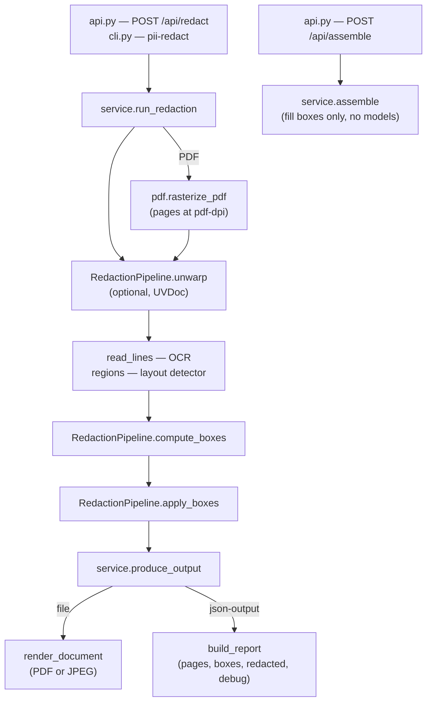

# How redaction works

This page follows one document from upload to redacted file and names the Python
classes and functions involved.

## Overview



| Layer | Module | Role |
|---|---|---|
| Entry points | [`api.py`](../backend/api.py), [`cli.py`](../backend/cli.py) | read input, apply EXIF orientation, validate options ([`options.py`](../backend/options.py)) |
| Service | [`service.py`](../backend/service.py) | framework-free core: `run_redaction` → `Redaction` (pages + `is_pdf`) → `produce_output` |
| Pipeline | [`pipeline.py`](../backend/pipeline.py) | `RedactionPipeline`: `unwarp`, `read_lines`, `regions`, `compute_boxes`, `apply_boxes` |
| Construction | [`factory.py`](../backend/factory.py) | `build_pipeline(config)`: OCR backend, layout detector, lazy classifier and unwarper factories |
| Detectors | [`rules.py`](../backend/rules.py), [`classifiers/`](../backend/classifiers/), [`harvest.py`](../backend/harvest.py), [`layout.py`](../backend/layout.py) | rules, model, name memory, layout regions |
| Shared types | [`models.py`](../backend/models.py), [`pii.py`](../backend/pii.py) | `Line`, `Box`; `Span` and `PiiLabel` — the one format every detector returns |
| Diagnostics | [`trace.py`](../backend/trace.py) | the debug trace (`?debug=true`, `PII_LOG_LEVEL=DEBUG`) |

The API builds **one pipeline per worker** at startup; the CLI one per run. The OCR
backend and layout model are loaded eagerly, a classifier and the dewarping model on
first use.

## Step by step

### 1. Pages

`run_redaction` turns the input into page images: a PDF is rasterized at
`pdf-dpi` ([`pdf.py`](../backend/pdf.py)); an image is used as decoded. All boxes
from here on are in the pixel space of these pages.

### 2. Dewarp (optional)

`RedactionPipeline.unwarp` flattens a photographed, curled page with UVDoc
([`unwarp.py`](../backend/unwarp.py)). It is a separate step on purpose: the page
that gets OCR'd is the page that gets redacted, so the boxes match by construction.

### 3. OCR and layout

- `read_lines` — PaddleOCR returns one `Line` (text, box, confidence) per text line
  ([`ocr/paddle.py`](../backend/ocr/paddle.py)).
- `regions` — PP-DocLayout returns typed `LayoutRegion`s: `text`, `table`,
  `header`, `footer`, `image`, `seal`, … ([`layout.py`](../backend/layout.py)).

### 4. `compute_boxes`

The heart of the pipeline, per page:

1. **Reading order.** `layout.document_order` groups lines by region (nested regions
   stay together) and orders them in bands, so the two columns of a letter do not
   interleave. `document.build_document` joins the lines into **one text** with a
   newline per line and remembers each line's character range.
2. **Item table.** `rules.item_table_indices` finds the fee table geometrically:
   lines with German amounts form rows, rows cluster by vertical gap, and a cluster
   of ≥ 2 rows spans the table. Inside it the classifier's findings are ignored —
   a two-word service text looks exactly like a name to a model — while the rules
   still apply.
3. **Pass one — what each line says.**
   - `rules.rule_spans` runs the deterministic rules per line (see below).
   - The classifier analyses the whole page text once and returns `Span`s;
     `document.spans_to_lines` maps them back to lines.
4. **Pass two — name memory.** `harvest.harvest` collects surnames named by pass one
   (patient label, title, salutation, birth-date line, or a classifier `PERSON`
   outside the item table). `harvest.name_spans` then marks every other line on the
   page that mentions one of them. The memory is shared across the pages of a
   document, so a name labelled on page 1 is caught bare on page 2 (forward only).
5. **Line boxes.** Every line that carries at least one span gets a box over the
   whole line, plus `padding`.
6. **Region boxes.** `layout.region_boxes` adds the only boxes not tied to an OCR
   line ([details](#layout-regions)).
7. **Trace.** `trace.trace_page` writes the commentary: region, its text, each line
   with its spans and verdict.

### 5. Output

`apply_boxes` fills the boxes on a copy of the page. `produce_output` returns either
the file (`render_document`: PDF via `pdf.assemble_pdf`, or JPEG) or the JSON
report (`build_report`). `POST /api/assemble` reuses only the last part —
`service.assemble` fills client-supplied boxes, without any model.

## Deterministic rules

All in [`rules.py`](../backend/rules.py); a trace line `rule NAME` names the pattern.

| Rule | Catches |
|---|---|
| `SALUT` | salutations (`Herrn`, `Frau`, `Familie`, …) — the recipient block |
| `PATIENT_NAME` | a person label with the name on the same line (`Patient: Muster, Andrea`) |
| `TITLE_NAME` | a title and name (`Dr. med. Max Mustermann`) |
| `NAME_DATE` | `Surname,Forename DD.MM.YY` — an unlabelled patient table row |
| `DE_STREET`, `DE_PLZ_CITY` | German street + number, postcode + city |
| `ORG_LEGAL`, `CONTACT`, `IMPRINT` | sender identity: legal form, URL/e-mail/phone, registry and bank identifiers |
| labelled values | spatial label ↔ value pairs (below) |

**Labelled values** (`labeled_value_indices`) pair a label with a value in a
*different* OCR line by geometry:

- **Birth date** — the date beside a `Geburtsdatum`/`geboren`/`Geb.Dat.` label, the
  dates in a column under a `Geburtsdatum` header, or one line with label and date
  (`geb. 01.02.1980`, `*01.02.1980`). A bare `geb.` is not a label (it also means
  *Gebühren*), and treatment dates stay visible.
- **Identifiers** — insurance, patient, case, admission, member and contract numbers
  next to their label. The invoice number is deliberately kept.
- **Names** — `Patient:` alone in its cell makes the name in the next cell (or the
  column below) a value, plus the person's details under it (e.g. the birth date
  under the name).

## Classifiers

Selectable per request (`?classifier=`); the rules above run with either.

| Classifier | Model | Notes |
|---|---|---|
| `presidio` *(default)* | spaCy `de_core_news_lg` NER + regex recognizers | entities `PERSON`, `DE_ADDRESS`, `EMAIL_ADDRESS`, `PHONE_NUMBER` (DE only), `IBAN_CODE`, `BIC_CODE`, `KONTO`, `CREDIT_CARD`. `LOCATION` is excluded. A `PERSON` needs ≥ 2 proper-noun tokens; pattern matches that only exist because two lines were joined are dropped |
| `guard-omni` | `hivetrace/gliner-guard-omni` (GLiNER2, zero-shot) | curated label set ([`pii.py`](../backend/pii.py)); long pages are analysed in windows; no source for identifiers or salutations — the rules cover those |

Both implement `Classifier.spans(text, trace) -> list[Span]`
([`classifiers/base.py`](../backend/classifiers/base.py)). The pipeline builds each
one on first use and keeps it (`RedactionPipeline.classifier`).

## Layout regions

`layout.region_boxes` blackens whole regions from PP-DocLayout
(`[redaction].redact_regions`, on by default):

- **`image`, `seal`, `header`, `footer`, `aside_text`** — always. This covers a
  letterhead logo, a stamp and a payment QR code: graphics OCR never reports.
- **Any other region** — once ≥ 40 % of its non-empty lines were flagged by the
  per-line pass. This catches the lines *between* hits in an address or sender
  block (a c/o line, a company name, a garbled line).

A line belongs to the smallest region containing its centre. There is no exception
for `table`: a fee table where most rows carry a patient name goes black. The
CLI flag `--debug-layout` draws what the detector saw.

## Models

| Model | Role | Stored in |
|---|---|---|
| `PP-OCRv6_medium_det` / `_rec` | text detection and recognition (German) | `.paddle_cache/official_models/` |
| `PP-DocLayout_plus-L` | layout regions | `.paddle_cache/official_models/` |
| `UVDoc` (+ `PP-LCNet_x1_0_doc_ori`, loaded but not applied) | dewarping | `.paddle_cache/official_models/` |
| `de_core_news_lg` | spaCy German NLP for `presidio` | Python package in `.venv` |
| `hivetrace/gliner-guard-omni` | `guard-omni` classifier | Hugging Face cache (`$HF_HOME`, default `~/.cache/huggingface`; `/app/.hf_cache` in Docker) |

With `ocr_backend = "onnxruntime"` the Paddle models run as their `_onnx`
variants — same weights, same output, about 3× faster on CPU. Libraries:
PaddleOCR/PaddleX, ONNX Runtime, Presidio, spaCy, GLiNER2 (CPU-only torch),
PyMuPDF (PDF in and out), Pillow (drawing).

## Project layout

```
backend/
  api.py          FastAPI app: request reading, response shaping, static SPA
  cli.py          batch CLI (flags = /api/redact query parameters)
  service.py      framework-free core shared by API and CLI
  pipeline.py     RedactionPipeline: unwarp / read_lines / regions / compute_boxes / apply_boxes
  factory.py      builds the pipeline from the config
  config.py       config.toml schema and env overrides
  options.py      query and body validation
  document.py     page text <-> lines (build_document, spans_to_lines)
  rules.py        deterministic German rules, labelled values, item table
  harvest.py      name memory
  layout.py       layout regions: reading order, region boxes, debug image
  pii.py          Span, PiiLabel and the label maps of both classifiers
  trace.py        debug trace
  replay.py       regression replay on frozen OCR (see Testing)
  pdf.py          rasterize / assemble PDFs
  unwarp.py       UVDoc dewarping
  ocr/            PaddleOCR backend
  classifiers/    presidio, guard-omni
frontend/         web UI (see Frontend)
docker/warmup.py  bakes the models into the Docker image
tests/            see Testing
```
